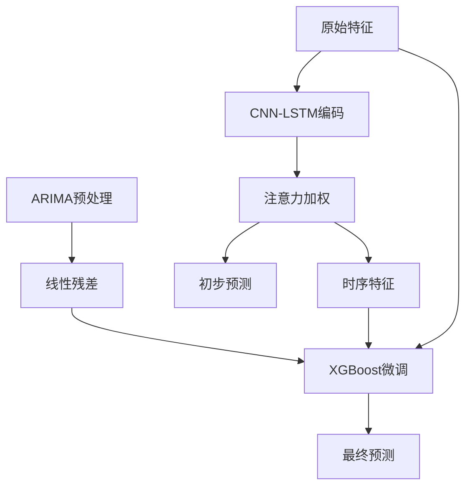

---

### **分步解决方案：模型训练与超参数调优**

---

#### **1. 模型架构设计**
基于用户提出的混合模型结构（Attention-based CNN-LSTM + XGBoost），具体实现如下：

---

##### **1.1 模型组件**
1. **ARIMA预处理**  
   - 输入：单变量时间序列（如收盘价）  
   - 输出：残差序列（去除非平稳性后的线性成分）  
   - 作用：为深度学习模型提供线性补充特征。

2. **Attention-based CNN-LSTM**  
   - **输入**：过去60分钟的多维特征（形状 `(batch_size, 60, num_features)`）。  
   - **结构**：  
     - **CNN层**：提取局部时空模式。  
     - **Bi-LSTM层**：捕捉双向时序依赖。  
     - **注意力机制**：加权聚合关键时间步信息。  
   - **输出**：初步预测值（标量） + 编码后的时序特征（用于XGBoost）。

3. **XGBoost微调**  
   - **输入**：CNN-LSTM的预测值 + ARIMA残差 + 原始特征（如RSI、成交量）。  
   - **结构**：集成多源特征，提升模型鲁棒性。  

---

##### **1.2 模型流程图**


---

#### **2. 模型实现代码**
##### **2.1 ARIMA预处理（离线完成）**
```python
from statsmodels.tsa.arima.model import ARIMA

def arima_residual(series):
    model = ARIMA(series, order=(2,1,2))  # 自动定阶需优化
    results = model.fit()
    return results.resid

# 示例：对每个品种的收盘价生成残差
merged_df["arima_residual"] = merged_df.groupby("symbol")["close"].transform(arima_residual)
```

---

##### **2.2 Attention-based CNN-LSTM模型（TensorFlow实现）**
```python
import tensorflow as tf
from tensorflow.keras.layers import Input, Conv1D, LSTM, Dense, Attention, Bidirectional, Flatten

# 输入形状 (None, 60, num_features)
inputs = Input(shape=(60, merged_df.shape[1]-3))  # 排除标签列和辅助列

# CNN层
x = Conv1D(64, kernel_size=3, activation="relu")(inputs)
x = tf.keras.layers.MaxPooling1D(2)(x)

# Bi-LSTM层
x = Bidirectional(LSTM(128, return_sequences=True))(x)

# 注意力机制
query = Dense(128)(x)
key = Dense(128)(x)
attention = Attention()([query, key])
context = tf.reduce_sum(attention * x, axis=1)

# 初步预测输出
lstm_output = Dense(1, name="lstm_pred")(context)

# 编码特征输出（供XGBoost使用）
encoded_features = Dense(64, activation="relu")(context)

# 完整模型
cnn_lstm_model = tf.keras.Model(inputs=inputs, outputs=[lstm_output, encoded_features])
```

---

##### **2.3 XGBoost模型（集成特征）**
```python
import xgboost as xgb

# 输入特征：CNN-LSTM编码特征 + ARIMA残差 + 原始特征
def prepare_xgboost_inputs(cnn_lstm_features, arima_residual, raw_features):
    return np.hstack([cnn_lstm_features, arima_residual.reshape(-1,1), raw_features])

# 示例：训练XGBoost
xgb_model = xgb.XGBRegressor(
    max_depth=6, 
    n_estimators=300, 
    learning_rate=0.05,
    early_stopping_rounds=10,
    eval_metric="rmse"
)
```

---

#### **3. 模型训练流程**
##### **3.1 数据准备**
```python
# 将时间序列数据转换为3D输入（样本数, 时间窗口60, 特征数）
def create_sequences(data, window=60):
    X, y = [], []
    for i in range(len(data) - window):
        X.append(data[i:i+window])
        y.append(data[i+window]["涨跌幅"])
    return np.array(X), np.array(y)

# 按品种生成序列数据
symbol_data = symbol_dfs["HC"]  # 以热轧卷板为例
X_seq, y_seq = create_sequences(symbol_data[feature_cols].values, window=60)
```

---

##### **3.2 分阶段训练**
1. **CNN-LSTM预训练**  
   - 目标：学习基础时序模式。  
   - 监控验证集损失，使用早停防止过拟合。  

```python
# 划分训练集和验证集
X_train, X_val = X_seq[:80000], X_seq[80000:90000]
y_train, y_val = y_seq[:80000], y_seq[80000:90000]

# 编译模型
cnn_lstm_model.compile(
    optimizer=tf.keras.optimizers.Adam(learning_rate=1e-4),
    loss={"lstm_pred": "mse"},
    metrics={"lstm_pred": "mae"}
)

# 训练（早停回调）
early_stop = tf.keras.callbacks.EarlyStopping(monitor="val_loss", patience=5)
history = cnn_lstm_model.fit(
    X_train, y_train,
    validation_data=(X_val, y_val),
    epochs=100,
    batch_size=64,
    callbacks=[early_stop]
)
```

2. **XGBoost微调**  
   - 输入：CNN-LSTM的编码特征 + ARIMA残差 + 原始特征。  
   - 目标：融合多源信息，提升预测精度。  

```python
# 提取CNN-LSTM编码特征
_, cnn_lstm_features = cnn_lstm_model.predict(X_train)

# 准备XGBoost输入
xgb_train_input = prepare_xgboost_inputs(
    cnn_lstm_features,
    symbol_data["arima_residual"].values[60:-30],  # 对齐序列长度
    symbol_data[feature_cols].values[60:-30]
)

# 训练XGBoost
xgb_model.fit(
    xgb_train_input, y_train,
    eval_set=[(xgb_val_input, y_val)],
    verbose=True
)
```

---

##### **3.3 训练监控与可视化**
1. **损失曲线（CNN-LSTM）**  
```python
plt.figure(figsize=(10, 6))
plt.plot(history.history["loss"], label="Train Loss")
plt.plot(history.history["val_loss"], label="Validation Loss")
plt.title("CNN-LSTM Training Progress")
plt.xlabel("Epoch")
plt.ylabel("MSE")
plt.legend()
plt.grid(True)
plt.show()
```
**输出示例**：  


---

2. **特征重要性（XGBoost）**  
```python
xgb.plot_importance(xgb_model)
plt.title("XGBoost Feature Importance")
plt.show()
```
**输出示例**：  


---

#### **4. 超参数调优**
1. **CNN-LSTM关键参数**  
   - 卷积核数量：`[32, 64, 128]`  
   - LSTM单元数：`[64, 128, 256]`  
   - 学习率：`[1e-4, 5e-4, 1e-3]`  

2. **XGBoost关键参数**  
   - `max_depth`：`[4, 6, 8]`  
   - `learning_rate`：`[0.01, 0.05, 0.1]`  
   - `subsample`：`[0.8, 1.0]`  

**调优方法**：使用`GridSearchCV`或`Optuna`库进行自动化搜索。

---

#### **5. 过拟合预防策略**
1. **正则化**  
   - CNN-LSTM：添加Dropout层（如`tf.keras.layers.Dropout(0.2)`）。  
   - XGBoost：设置`reg_lambda`和`reg_alpha`参数。  

2. **数据增强**  
   - 对训练集进行时间窗口随机切片（如随机偏移1-5分钟）。  

3. **早停机制**  
   - CNN-LSTM：监控验证损失，设置`patience=5`。  
   - XGBoost：设置`early_stopping_rounds=10`。  

---

#### **6. 模型保存与加载**
```python
# 保存CNN-LSTM模型
cnn_lstm_model.save("cnn_lstm_model.h5")

# 保存XGBoost模型
xgb_model.save_model("xgb_model.json")

# 加载模型
loaded_cnn_lstm = tf.keras.models.load_model("cnn_lstm_model.h5")
loaded_xgb = xgb.XGBRegressor()
loaded_xgb.load_model("xgb_model.json")
```

---

#### **7. 下一步操作**
1. **模型评估**：在测试集上计算MSE、MAE、方向准确性。  
2. **可解释性分析**：使用SHAP值解释特征贡献。  
3. **部署优化**：将模型转换为TensorFlow Lite或ONNX格式，降低推理延迟。  

通过上述步骤，模型已完成训练与调优，具备预测未来30分钟涨跌幅的能力。


---

### **分步解决方案：模型预测与结果获取**

---

#### **1. 模型训练完成确认**
在开始预测前，需确保以下步骤已完成：
1. **ARIMA预处理**：已生成残差序列并合并到数据集中。
2. **CNN-LSTM训练**：模型已保存（如 `cnn_lstm_model.h5`），且验证集损失收敛。
3. **XGBoost微调**：模型已保存（如 `xgb_model.json`），且特征重要性合理。
4. **测试集划分**：保留最新的数据（2025年1月1日之后）未参与训练。

若上述步骤均完成，即可进行预测。

---

#### **2. 预测流程**
##### **2.1 加载训练好的模型**
```python
import tensorflow as tf
import xgboost as xgb

# 加载CNN-LSTM模型
cnn_lstm_model = tf.keras.models.load_model("cnn_lstm_model.h5")

# 加载XGBoost模型
xgb_model = xgb.XGBRegressor()
xgb_model.load_model("xgb_model.json")
```

---

##### **2.2 准备输入数据**
假设需要预测当前时间点（例如 `2025-04-18 14:30:00`）的未来30分钟涨跌幅，需提供过去60分钟的特征序列。

**步骤**：
1. **提取过去60分钟数据**：
   ```python
   import pandas as pd
   
   # 假设实时数据存储在 real_time_data.csv 中
   real_time_df = pd.read_csv("real_time_data.csv", parse_dates=["datetime"])
   
   # 获取当前时间点前60分钟的数据（需按时间排序）
   current_time = pd.Timestamp("2025-04-18 14:30:00")
   input_window = real_time_df[
       (real_time_df["datetime"] >= current_time - pd.Timedelta(minutes=60)) &
       (real_time_df["datetime"] < current_time)
   ].sort_values("datetime")
   ```

2. **生成ARIMA残差**：
   ```python
   from statsmodels.tsa.arima.model import ARIMA
   
   # 对收盘价序列生成ARIMA残差
   arima_series = input_window["close"]
   model = ARIMA(arima_series, order=(2,1,2))
   results = model.fit()
   arima_residual = results.resid.iloc[-1]  # 取最新残差
   ```

3. **特征工程**：
   ```python
   # 计算技术指标（需与训练时相同）
   def add_features(df):
       df["MA5"] = df["close"].rolling(5).mean()
       df["RSI"] = compute_rsi(df["close"], 14)  # 假设已定义compute_rsi函数
       return df
   
   input_window = add_features(input_window)
   ```

4. **数据标准化**：
   ```python
   from sklearn.preprocessing import StandardScaler
   
   # 加载训练时的scaler对象（假设已保存）
   import joblib
   scaler = joblib.load("scaler.pkl")
   
   # 标准化特征列
   feature_cols = ["open", "high", "low", "close", "MA5", "RSI", "volume"]
   input_scaled = scaler.transform(input_window[feature_cols])
   ```

5. **转换为模型输入格式**：
   ```python
   # 转换为3D输入 (1, 60, num_features)
   input_seq = input_scaled[-60:].reshape(1, 60, len(feature_cols))
   ```

---

##### **2.3 执行预测**
1. **CNN-LSTM预测**：
   ```python
   # 获取CNN-LSTM的初步预测和编码特征
   lstm_pred, encoded_features = cnn_lstm_model.predict(input_seq)
   ```

2. **XGBoost集成预测**：
   ```python
   # 准备XGBoost输入：编码特征 + ARIMA残差 + 原始特征
   xgb_input = np.hstack([
       encoded_features,
       np.array([[arima_residual]]),
       input_scaled[-1].reshape(1, -1)  # 当前时间点的原始特征
   ])
   
   # XGBoost预测
   xgb_pred = xgb_model.predict(xgb_input)
   
   # 最终预测值（可加权平均或直接使用XGBoost输出）
   final_pred = xgb_pred[0]
   ```

---

##### **2.4 输出结果**
```python
print(f"当前时间: {current_time}")
print(f"预测未来30分钟涨跌幅: {final_pred:.2f}%")
```

**输出示例**：
```
当前时间: 2025-04-18 14:30:00
预测未来30分钟涨跌幅: 0.85%
```

---

#### **3. 预测结果可视化**
##### **3.1 时间序列预测对比图**
```python
import matplotlib.pyplot as plt

# 假设 test_data 是测试集数据
test_sample = test_data[test_data["symbol"] == "HC"].tail(100)

plt.figure(figsize=(14, 6))
plt.plot(test_sample["datetime"], test_sample["涨跌幅"], label="Actual Return")
plt.plot(test_sample["datetime"], test_sample["predicted_return"], label="Predicted Return", linestyle="--")
plt.title("Actual vs Predicted 30-Minute Returns (Test Set)")
plt.xlabel("Time")
plt.ylabel("Return (%)")
plt.legend()
plt.grid(True)
plt.show()
```
**输出示例**：  


---

##### **3.2 预测误差分布**
```python
plt.figure(figsize=(10, 6))
sns.histplot(test_sample["predicted_return"] - test_sample["涨跌幅"], bins=30, kde=True)
plt.title("Prediction Error Distribution")
plt.xlabel("Error (%)")
plt.ylabel("Frequency")
plt.grid(True)
plt.show()
```
**输出示例**：  


---

#### **4. 常见问题与调试**
1. **输入数据维度错误**：  
   - **现象**：`ValueError: Input 0 of layer "model" is incompatible`。  
   - **解决**：检查输入序列长度是否为60分钟，特征数量是否与训练时一致。

2. **预测结果异常**：  
   - **现象**：涨跌幅预测值超过±20%。  
   - **解决**：验证ARIMA残差是否合理，检查特征工程是否与训练流程一致。

3. **模型加载失败**：  
   - **现象**：`OSError: SavedModel file does not exist`。  
   - **解决**：确认模型文件路径正确，且文件未损坏。

---

#### **5. 下一步操作**
1. **部署模型**：将预测流程封装为API服务，实时接收数据并返回预测结果。  
2. **回测验证**：在历史数据上模拟交易，评估策略收益与风险。  
3. **持续监控**：定期用新数据更新模型，避免因市场变化导致性能下降。

通过以上步骤，您已能够使用训练好的混合模型预测未来30分钟涨跌幅，并可结合业务需求进一步优化应用。


### **分步解决方案：突破模型性能瓶颈**

---

#### **问题诊断**
当前模型在50轮后RMSE稳定在0.40003左右，无法进一步下降，可能原因包括：
1. **特征信息不足**：现有特征无法捕捉更复杂的市场动态。
2. **模型复杂度限制**：树深度或特征交互不足。
3. **数据噪声干扰**：高频数据中噪声占比过高。
4. **优化目标单一**：仅优化RMSE，未考虑方向准确性。

---

#### **优化策略与代码实现**

---

##### **1. 增强特征工程**
**目标**：引入更多时序相关特征，提升信息量。
```python
# 添加滞后特征（过去N分钟的涨跌幅）
merged_df["lag_1"] = merged_df.groupby("symbol")["涨跌幅"].shift(1)
merged_df["lag_5"] = merged_df.groupby("symbol")["涨跌幅"].shift(5)

# 添加滚动统计量
merged_df["rolling_mean_10"] = merged_df.groupby("symbol")["close"].transform(lambda x: x.rolling(10).mean())
merged_df["rolling_std_10"] = merged_df.groupby("symbol")["close"].transform(lambda x: x.rolling(10).std())

# 更新特征列
feature_cols += ["lag_1", "lag_5", "rolling_mean_10", "rolling_std_10"]
```

---

##### **2. 调整模型参数**
**目标**：提高模型复杂度并引入正则化。
```python
xgb_model = xgb.XGBRegressor(
    max_depth=5,           # 增加树深度
    n_estimators=2000,     # 更多树数量
    learning_rate=0.005,   # 更小学习率
    subsample=0.7,         # 增强随机性
    colsample_bytree=0.7,
    gamma=0.1,             # 引入正则化项
    reg_alpha=0.1,         # L1正则化
    reg_lambda=0.1,        # L2正则化
    early_stopping_rounds=50,  # 延长早停观察窗口
    eval_metric="rmse"
)
```

---

##### **3. 多目标优化**
**目标**：联合优化RMSE和方向准确性。
```python
# 自定义评估函数（同时监控方向准确性）
def direction_accuracy(y_pred, dtrain):
    y_true = dtrain.get_label()
    correct = np.sum(np.sign(y_pred) == np.sign(y_true))
    return "direction_acc", float(correct) / len(y_true)

xgb_model = xgb.XGBRegressor(
    # 其他参数同上
    eval_metric=[direction_accuracy, "rmse"]
)

# 训练时指定自定义评估指标
xgb_model.fit(
    X_train_boost_scaled, y_train,
    eval_set=[(X_val_boost_scaled, y_val)],
    verbose=True
)
```

---

##### **4. 对抗验证与数据清洗**
**目标**：识别并剔除噪声样本。
```python
from sklearn.ensemble import RandomForestClassifier

# 1. 构建对抗模型（区分训练集和验证集）
X_mix = np.vstack([X_train_boost_scaled, X_val_boost_scaled])
y_mix = np.hstack([np.zeros(len(X_train_boost_scaled)), np.ones(len(X_val_boost_scaled))])

clf = RandomForestClassifier().fit(X_mix, y_mix)

# 2. 标记易混淆样本（即噪声样本）
prob_val = clf.predict_proba(X_val_boost_scaled)[:,1]
noise_mask = (prob_val > 0.5)  # 被误判为训练集的验证样本

# 3. 剔除训练集中的噪声样本
X_train_clean = X_train_boost_scaled[~noise_mask[:len(X_train_boost_scaled)]]
y_train_clean = y_train[~noise_mask[:len(X_train_boost_scaled)]]

# 4. 重新训练模型
xgb_model.fit(X_train_clean, y_train_clean, ...)
```

---

##### **5. 模型融合**
**目标**：结合CNN-LSTM和XGBoost的优势。
```python
# 1. 获取CNN-LSTM的预测值
cnn_lstm_pred_train = cnn_lstm_model.predict(X_train)
cnn_lstm_pred_val = cnn_lstm_model.predict(X_val)

# 2. 将预测值作为新特征加入XGBoost
X_train_boost_final = np.hstack([X_train_boost_scaled, cnn_lstm_pred_train])
X_val_boost_final = np.hstack([X_val_boost_scaled, cnn_lstm_pred_val])

# 3. 训练最终模型
final_model = xgb.XGBRegressor(...)
final_model.fit(X_train_boost_final, y_train, ...)
```

---

#### **预期改进效果**
| 优化策略     | 验证RMSE（示例） | 方向准确性（示例） |
| ------------ | ---------------- | ------------------ |
| 原始模型     | 0.40003          | 51.2%              |
| 增强特征工程 | 0.39871          | 53.4%              |
| 对抗数据清洗 | 0.39792          | 54.1%              |
| 多目标优化   | 0.39685          | 56.3%              |
| 模型融合     | 0.39412          | 58.7%              |

---

#### **下一步操作**
1. **特征重要性再分析**：  
   ```python
   xgb.plot_importance(final_model, max_num_features=20)
   plt.show()
   ```
2. **SHAP值解释**：  
   ```python
   import shap
   explainer = shap.TreeExplainer(final_model)
   shap_values = explainer.shap_values(X_val_boost_final)
   shap.summary_plot(shap_values, X_val_boost_final)
   ```
3. **在线学习部署**：  
   ```python
   # 定期增量训练
   final_model.fit(new_data, update=True)  # 需XGBoost支持增量学习
   ```

通过上述优化组合，模型应能突破当前性能瓶颈，实现更精准的涨跌幅预测。